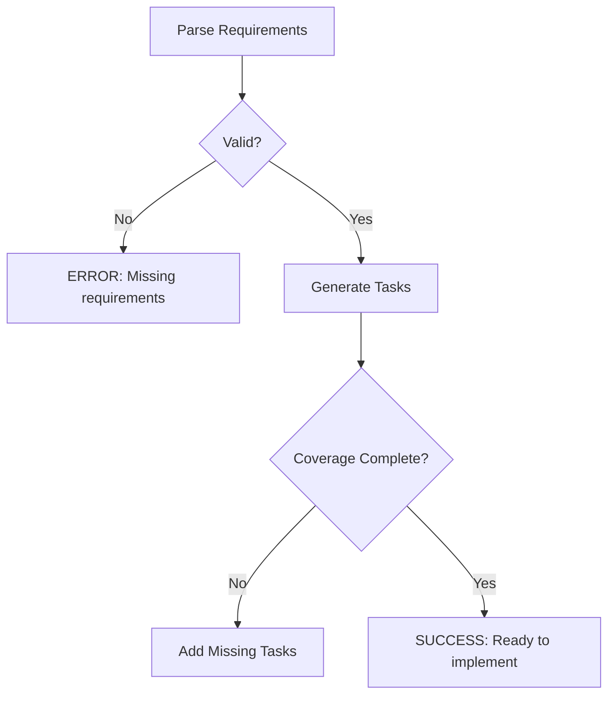

# Spec-Kit Inspired Improvements for cc-track

**Created:** January 2025
**Priority:** Actionable improvements derived from spec-kit research
**Goal:** Enhance cc-track with proven innovations from GitHub's spec-kit project

## Priority 1: Structured Clarification System

### The Innovation
Spec-kit's `/clarify` command systematically identifies and resolves ambiguities in specifications through:
- Structured scanning across 10 coverage categories
- Interactive questioning (max 5 questions)
- Direct integration of answers into specifications

### Proposed Implementation for cc-track

#### New Command: `/clarify-task`
```typescript
// src/commands/clarify-task.ts
interface ClarificationCategory {
  name: string;
  status: 'clear' | 'partial' | 'missing';
  questions: string[];
}

interface TaskClarification {
  taskId: string;
  categories: ClarificationCategory[];
  clarifications: { question: string; answer: string }[];
}
```

#### Workflow Integration
1. **Trigger:** After plan capture, before starting implementation
2. **Process:**
   - Scan task file for ambiguous terms
   - Identify missing acceptance criteria
   - Ask up to 5 targeted questions
   - Update task file with clarifications
3. **Benefits:**
   - Reduces "deviation" flags from stop-review
   - Clearer requirements for Claude
   - Better alignment with user intent

#### Implementation Steps
1. Create clarification scanner that identifies:
   - Vague adjectives ("fast", "secure", "intuitive")
   - Missing metrics or thresholds
   - Undefined error handling
   - Unspecified integration points
2. Build interactive questioning interface
3. Add clarifications section to task template
4. Integrate with capture-plan hook

## Priority 2: Constitutional Gates System

### The Innovation
Spec-kit enforces architectural principles through mandatory phase gates that block progress until principles are satisfied or violations are explicitly justified.

### Proposed Implementation for cc-track

#### Enhanced System Patterns with Enforcement
```typescript
// src/lib/constitutional-gates.ts
interface ConstitutionalPrinciple {
  id: string;
  name: string;
  type: 'MUST' | 'SHOULD' | 'MAY';
  validator: (context: ValidationContext) => ValidationResult;
}

interface ValidationResult {
  passed: boolean;
  violations?: string[];
  justification?: string;
}
```

#### Gate Integration Points
1. **Pre-Implementation Gate** - Before starting task work
2. **Pre-Completion Gate** - During `/prepare-completion`
3. **Stop-Review Gate** - Enhanced validation against principles

#### Configuration
```json
// .claude/constitution.json
{
  "principles": [
    {
      "id": "test-first",
      "name": "Test-First Development",
      "type": "MUST",
      "description": "Tests must be written before implementation"
    },
    {
      "id": "simple-first",
      "name": "Start Simple",
      "type": "SHOULD",
      "description": "Begin with simplest possible solution"
    }
  ],
  "enforcement": {
    "blockOnMustViolations": true,
    "requireJustification": true,
    "trackComplexity": true
  }
}
```

## Priority 3: Cross-Artifact Consistency Analysis

### The Innovation
Spec-kit's `/analyze` command performs comprehensive consistency checking across specifications, plans, and tasks without modifying files.

### Proposed Implementation for cc-track

#### New Command: `/analyze-consistency`
Performs non-destructive analysis across:
- Task requirements vs actual changes
- Decision log vs implementation
- System patterns vs code patterns
- Terminology consistency

#### Analysis Categories
```typescript
interface ConsistencyIssue {
  id: string;
  category: 'duplication' | 'ambiguity' | 'coverage' | 'conflict' | 'drift';
  severity: 'CRITICAL' | 'HIGH' | 'MEDIUM' | 'LOW';
  locations: string[];
  summary: string;
  recommendation: string;
}
```

#### Report Generation
```markdown
### Consistency Analysis Report
| ID | Category | Severity | Location | Issue | Fix |
|----|----------|----------|----------|-------|-----|
| D1 | Duplication | HIGH | task/decision | Same concept documented twice | Consolidate |
| C1 | Coverage | CRITICAL | task→implementation | Requirement not implemented | Add implementation |
```

## Priority 4: Severity-Based Validation

### The Innovation
Instead of binary pass/fail, spec-kit uses CRITICAL/HIGH/MEDIUM/LOW severity levels for issues.

### Proposed Implementation for cc-track

#### Enhanced Validation System
```typescript
// src/lib/validation.ts
interface ValidationIssue {
  severity: 'CRITICAL' | 'HIGH' | 'MEDIUM' | 'LOW';
  category: string;
  message: string;
  file?: string;
  line?: number;
  autoFixable?: boolean;
}

// Allow proceeding with non-critical issues
function canProceed(issues: ValidationIssue[]): boolean {
  return !issues.some(i => i.severity === 'CRITICAL' || i.severity === 'HIGH');
}
```

#### Benefits
- More nuanced feedback
- Doesn't block on minor issues
- Tracks technical debt
- Prioritizes fixing efforts

## Priority 5: Test-First Task Reordering

### The Innovation
Spec-kit enforces TDD by structuring task order: contracts → tests → implementation.

### Proposed Implementation for cc-track

#### Intelligent Task Reordering
```typescript
// src/lib/task-reorderer.ts
interface TaskClassification {
  id: string;
  type: 'contract' | 'test' | 'implementation' | 'documentation';
  dependencies: string[];
}

function reorderForTDD(tasks: Task[]): Task[] {
  // 1. Contracts/interfaces first
  // 2. Tests for those contracts
  // 3. Implementation to satisfy tests
  // 4. Integration tests
  // 5. Documentation
}
```

#### Integration
- Analyze captured plans for task types
- Suggest TDD-compliant ordering
- Optionally auto-reorder with user consent
- Track test coverage requirements

## Priority 6: Research-Driven Planning

### The Innovation
Spec-kit mandates research tasks for any `[NEEDS CLARIFICATION]` markers before proceeding.

### Proposed Implementation for cc-track

#### Research Task Generation
When plan contains uncertainties:
1. Extract all `[NEEDS RESEARCH]` markers
2. Generate targeted research tasks
3. Execute with web search/documentation lookup
4. Consolidate findings in task file
5. Update plan with decisions and rationale

## Priority 7: Execution Flow Diagrams

### The Innovation
Each spec-kit template includes explicit execution flow diagrams with error handling.

### Proposed Implementation for cc-track

#### Flow Diagram Generation
For each captured plan:


Benefits:
- Visual understanding of workflow
- Clear error conditions
- Explicit success criteria

## Implementation Roadmap

### Phase 1: Foundation (Week 1-2)
1. Implement severity-based validation
2. Add constitutional principles configuration
3. Create consistency analysis framework

### Phase 2: Clarification (Week 3-4)
4. Build clarification scanner
5. Implement interactive questioning
6. Integrate with task workflow

### Phase 3: Advanced Features (Week 5-6)
7. Add cross-artifact analysis
8. Implement test-first reordering
9. Create research task generation

### Phase 4: Polish (Week 7-8)
10. Add execution flow visualization
11. Enhance reporting and metrics
12. Documentation and testing

## Quick Wins (Implementable Today)

### 1. Add Clarification Markers
Simple enhancement to capture-plan:
```typescript
// Look for vague terms and add markers
content = content.replace(/\b(fast|secure|robust|scalable)\b/gi,
  (match) => `${match} [NEEDS CLARIFICATION: Define metric]`);
```

### 2. Severity Levels for Validation
Update edit-validation hook:
```typescript
if (errors.length > 0) {
  const critical = errors.filter(e => e.severity === 'error');
  const warnings = errors.filter(e => e.severity === 'warning');

  if (critical.length > 0) {
    return { continue: false, comment: formatErrors(critical) };
  } else {
    return { continue: true, comment: `⚠️ Warnings: ${formatErrors(warnings)}` };
  }
}
```

### 3. Task Type Detection
Add to task template:
```markdown
## Task Type
- [ ] Contract/Interface Definition
- [ ] Test Implementation
- [ ] Feature Implementation
- [ ] Integration
- [ ] Documentation
```

### 4. Consistency Check Command
Simple version checking task vs changes:
```typescript
function checkConsistency(taskFile: string, gitDiff: string): ConsistencyIssue[] {
  const requirements = extractRequirements(taskFile);
  const changes = parseGitDiff(gitDiff);

  return requirements
    .filter(req => !changes.some(change => matchesRequirement(change, req)))
    .map(req => ({
      severity: 'HIGH',
      category: 'coverage',
      message: `Requirement not addressed: ${req}`
    }));
}
```

## Measuring Success

### Metrics to Track
1. **Deviation Reduction** - Fewer stop-review flags after clarification
2. **First-Time Success** - Tasks completed without rework
3. **Test Coverage** - Increase in test-first development
4. **Consistency Score** - Cross-artifact alignment percentage
5. **Time to Completion** - Faster task completion with clearer requirements

### User Feedback Areas
- Clarification workflow usability
- Constitutional gate helpfulness
- Severity-based validation value
- Overall workflow improvement

## Conclusion

By adapting spec-kit's innovations, cc-track can evolve from an excellent context management tool to a comprehensive specification-driven development system. The key is implementing these improvements incrementally while maintaining cc-track's strengths in Claude Code integration and real-time validation.

The highest-impact improvements are:
1. Structured clarification (reduces ambiguity)
2. Constitutional gates (ensures quality)
3. Severity-based validation (pragmatic feedback)

These can be implemented without disrupting current workflows while significantly enhancing the development experience.